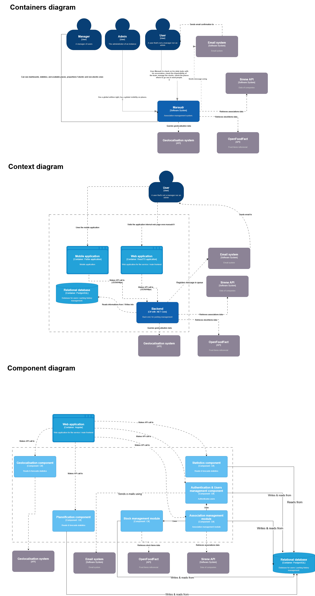
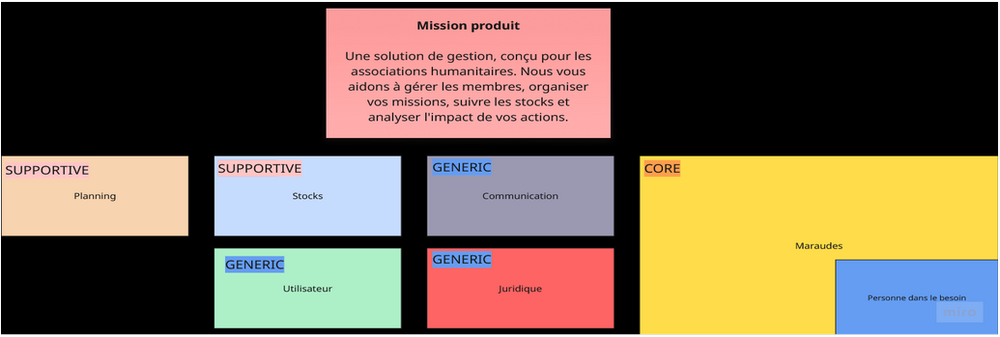
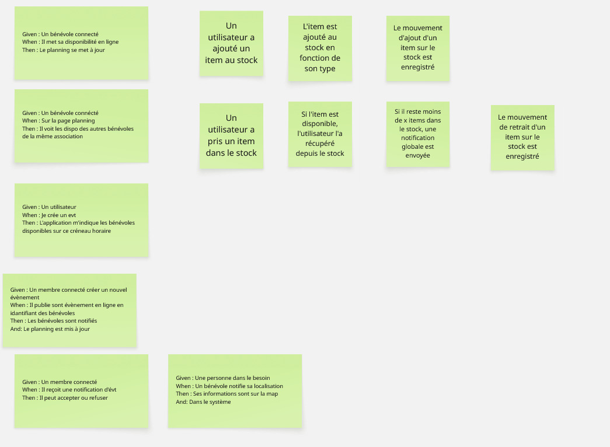

# Maraudr

## Etat d’avancement: 
~ 30 % du code : 
Gestion des utilisateurs - 80 %
Gestion des stocks - 80 %
Gestion des associations - 50 %
Premières ébauches du front  - 20 %

## Modèle de conception du projet retenu:
DDD (Domain-Driven Design)
Le développement de la partie backend de l’application est écrite en C# & .NET 8 et respecte la philosophie du DDD.
## Architecture logicielle retenue: 

Nous faisons une approche Modular Monolith et  l’architecture des modules s’inspire du modèle de la Clean Architecture.

### Les avantages du Modular Monolith que nous avons retenu : 
#### Simplicité de déploiement : une seule application à déployer.
####  Séparation claire des responsabilités : les modules rendent le code plus lisible,   testable et maintenable.
#### Évolutif : facilite une future migration vers une architecture microservices si nécessaire.
#### Travail en équipe facilité : chaque membre peut se concentrer sur son module.

## Type d’application: 

Application web moderne, backend qui expose des endpoints et s’occupe de la logique métier.
Application mobile pour enrichir l’application avec des données du terrain.

## Architecture C4 Globale

## Domaine: 
Domain

## Certains uses - cases : 

## Modèle de gestion de projet front

### TDD (Test-Driven Development) partiel :
 Application sur le frontend pour les composants React, avec des tests écrits avant ou pendant le développement.

### Politique de merge 
PR Validation par au moin un  membre de l’équipe

### CI/CD (Intégration Continue) :

 Pipeline GitHub Actions configuré pour exécuter les tests unitaires et vérifier la qualité du code à chaque commit
